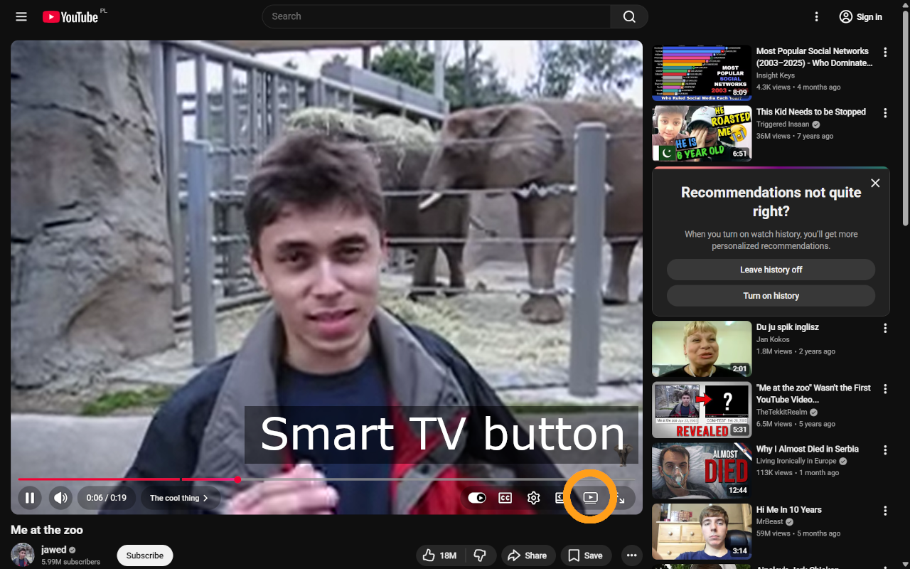
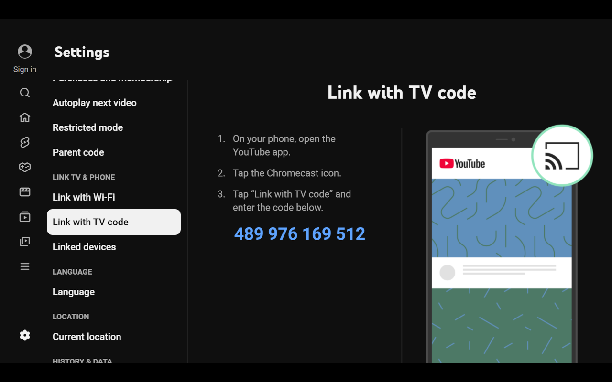
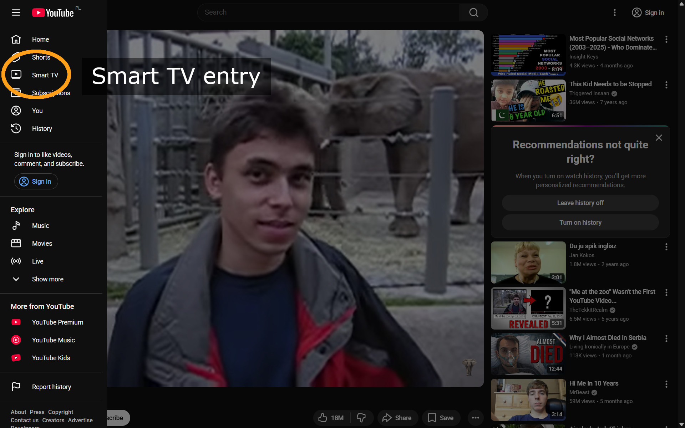
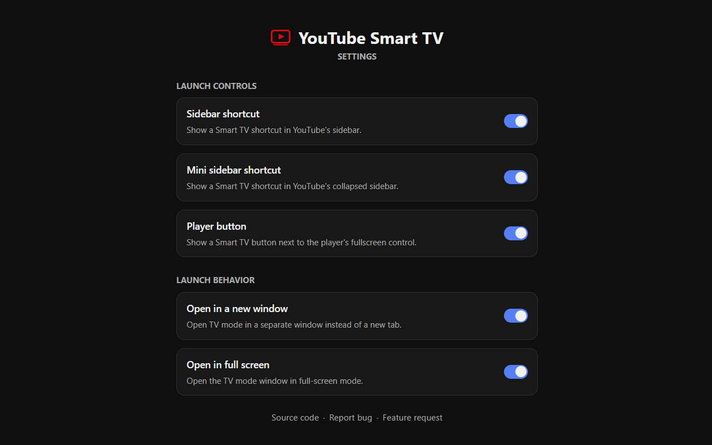

# YouTube Smart TV

## Store listing

### Product details

#### Summary from package

Open YouTube in TV mode with one click.

#### Description

YouTube Smart TV adds convenient launch controls to standard YouTube pages, making it easy to open YouTube's TV interface without manually changing the URL.

Main features:

- Adds Smart TV shortcuts to the full and compact YouTube sidebars.
- Adds a Smart TV button next to the player's fullscreen control.
- Opens the current video in TV mode and preserves its playback position when launched from the player.
- Opens TV mode in a new tab or a dedicated window, with optional fullscreen mode.
- Lets you choose which controls are visible and how TV mode opens.
- Lets you close TV mode with Esc; holding Esc for three seconds provides a fallback.

Typical use case:
Start a video on YouTube, switch to the TV interface, then pair your phone with a TV code and use it as a remote control.

#### Category

Entertainment

#### Language

English

### Graphic assets

#### Store icon

#### Global promo video

none

#### Screenshots

#### Small promo tile

none

#### Marquee promo tile

none

### Additional fields

#### Official URL

none

#### Homepage URL

https://github.com/rafalczajka/yt-smart-tv

#### Support URL

https://github.com/rafalczajka/yt-smart-tv/issues/new/choose

## Privacy

### Single purpose

#### Single purpose description

Add launch controls to YouTube pages that open YouTube's TV interface, optionally preserving the current video and playback position.

### Permission justification

#### declarativeNetRequest justification

Overrides the User-Agent header only for top-level requests to youtube.com/tv, allowing YouTube to serve its TV interface in a desktop browser.

#### storage justification

Stores user preferences in the browser's synchronized extension storage, including button visibility and whether TV mode opens in a tab, a separate window, or fullscreen.

#### Host permission justification

Allows the extension to run on YouTube pages so it can add Smart TV controls, read the current page URL and video playback position, and detect TV-mode exit screens.

## Test instructions

No extension-specific credentials are required. A YouTube sign-in may be required for restricted or account-specific content.

1. Open a YouTube video page.
2. Confirm that the Smart TV sidebar entry and the player button next to the fullscreen control are visible.
3. Start playback, click the player button, and confirm that the TV interface opens with the same video at approximately the same playback position.
4. Press Esc until YouTube displays its exit screen and confirm that the TV tab or window closes automatically.
5. Reopen TV mode and hold Esc for three seconds to verify the fallback exit behavior.
6. Open the extension's settings page, change the "Launch controls" and "Launch behavior" settings, and verify that the corresponding controls and tab or window behavior update.
